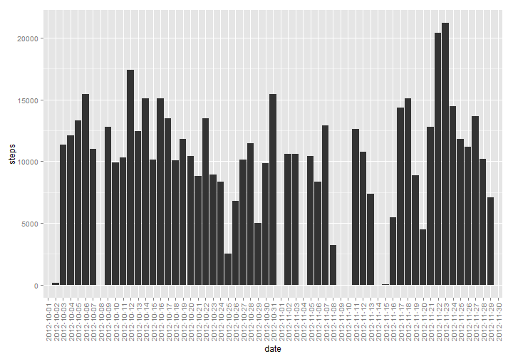
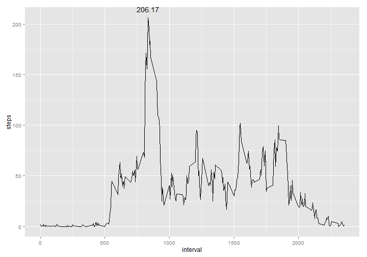
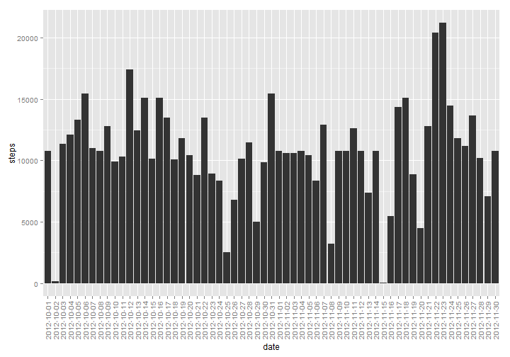
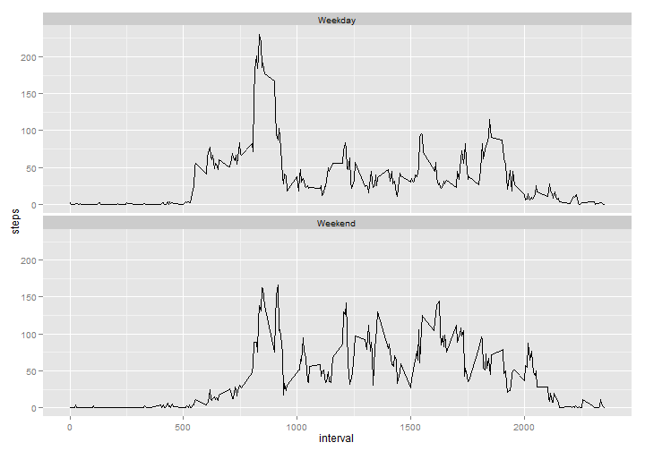

# Assignment 1
===========================================

## First we need to load the data from the current WD, and load all the libaries.

```r
library(ggplot2)
library(xtable)
data <- read.csv("activity.csv")
```

### What is mean total number of steps taken per day?
First, we want to see a histogram of the total number of steps taken per day.

```r
hist1data <- aggregate(list(steps=data$steps), by=list(date=data$date), FUN=sum)

hist1 <- ggplot(hist1data, aes(x=date, y=steps)) + geom_histogram(stat="identity")
hist1 <- hist1 + theme(axis.text.x=element_text(angle=90, hjust=1, vjust=0.5))

print(hist1)
```

```
## Warning: Removed 8 rows containing missing values (position_stack).
```

 

The mean and median for the total number of steps is per day:

```r
xt <- xtable(data.frame(mean = mean(hist1data$steps, na.rm=TRUE)
                        , median = median(hist1data$steps, na.rm=TRUE)))
print(xt, type="html")
```

<!-- html table generated in R 3.0.3 by xtable 1.7-3 package -->
<!-- Sat Jun 14 18:01:27 2014 -->
<TABLE border=1>
<TR> <TH>  </TH> <TH> mean </TH> <TH> median </TH>  </TR>
  <TR> <TD align="right"> 1 </TD> <TD align="right"> 10766.19 </TD> <TD align="right"> 10765 </TD> </TR>
   </TABLE>

### What is the average daily activity pattern?
Below is a time series plot showing the average number of steps  
accross all days for each 5-minute interval.

```r
time1data <- aggregate(list(steps=data$steps), by=list(interval=data$interval)
                       , FUN=mean, na.rm=TRUE)
maxvalue <- round(max(time1data$steps),0)
maxinterval <- time1data[time1data$steps == max(time1data$steps),"interval"]

time1 <- ggplot(time1data, aes(x=interval, y=steps)) + geom_line()
time1 <- time1 + geom_text(data = 
                        time1data[time1data$steps == max(time1data$steps),]
                , aes(label = round(max(time1data$steps),2), vjust=-1
                      ))
print(time1)
```

 

Maximum average value of 206 (rounded to the nearest step)  
is on the 835th interval.  

### Imputing missing values.

```r
numNA <- sum(is.na(data$steps))
```
Looking at the data we know that in the steps field there are 2304 NAs.

Becuase there are so many NAs we are going to impute the NA values by  
replacing them with the average number of steps taken for that interval. 


```r
dataimputed <- data[is.na(data$steps) == FALSE, ]
nanewval <- data[is.na(data$steps) == TRUE, ]
nanewval1 <- merge(nanewval, time1data, by.x = "interval", by.y="interval"
                   , all= FALSE)
names(nanewval1) <- c("interval", "steps.x", "date", "steps")
dataimputed <- rbind(dataimputed, nanewval1[, c("interval", "date", "steps")])

hist2data <- aggregate(list(steps=dataimputed$steps)
                       , by=list(date=dataimputed$date), FUN=sum)

hist2 <- ggplot(hist2data, aes(x=date, y=steps)) + geom_histogram(stat="identity")
hist2 <- hist2 + theme(axis.text.x=element_text(angle=90, hjust=1, vjust=0.5))

print(hist2)
```

 


The mean and median for the total number of steps is per day:

```r
xt <- xtable(data.frame(mean = mean(hist2data$steps, na.rm=TRUE)
                        , median = median(hist2data$steps, na.rm=TRUE)))
print(xt, type="html")
```

<!-- html table generated in R 3.0.3 by xtable 1.7-3 package -->
<!-- Sat Jun 14 18:01:28 2014 -->
<TABLE border=1>
<TR> <TH>  </TH> <TH> mean </TH> <TH> median </TH>  </TR>
  <TR> <TD align="right"> 1 </TD> <TD align="right"> 10766.19 </TD> <TD align="right"> 10766.19 </TD> </TR>
   </TABLE>

Because in the first case we simply ommitted the missing values, and in the  
second case we just added the mean value, the overall means won't change.  
In addition, because median is just the middle point, when we added more  
records into the center of the dataset, that were all the mean, then the median  
became the mean. There is no real impact in adding these values on the median  
or mean of our dataset. But there could be a great impact if we start trying  
to draw conclusions on the specific days that contain imputed data.

### Are there differences in activity patterns between weekdays and weekends?

Looking at the chart below you can see that Weekdays typically start earlier  
for and there is a more pronounced spice around interval 850. But there is  
higher activity on average for the rest of the time, however, both peter out  
around the same time as well.

```r
dataimputedweek <- dataimputed
dataimputedweek[,"DOW"] <- as.factor(weekdays(as.Date(as.character(dataimputed$date))))
dataimputedweek[,"weekday"] <- as.factor(dataimputedweek[,"DOW"])

levels(dataimputedweek$weekday) <- list(Weekday=c("Monday","Tuesday"
                                                  ,"Wednesday","Thursday"
                                                  ,"Friday")
                                      , Weekend=c("Saturday","Sunday"))

time2data <- aggregate(list(steps=dataimputedweek$steps), 
                       by=list(interval=dataimputedweek$interval
                             , weekday=dataimputedweek$weekday)
                       , FUN=mean, na.rm=TRUE)
time2 <- ggplot(time2data, aes(x=interval, y=steps)) + geom_line()
time2 <- time2 + facet_wrap(~weekday, ncol=1 )
print(time2)
```

 


